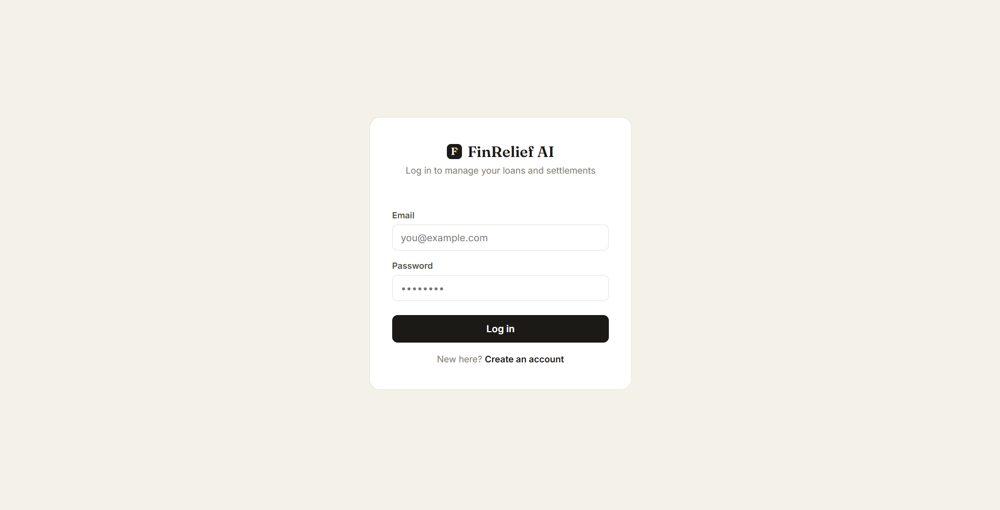
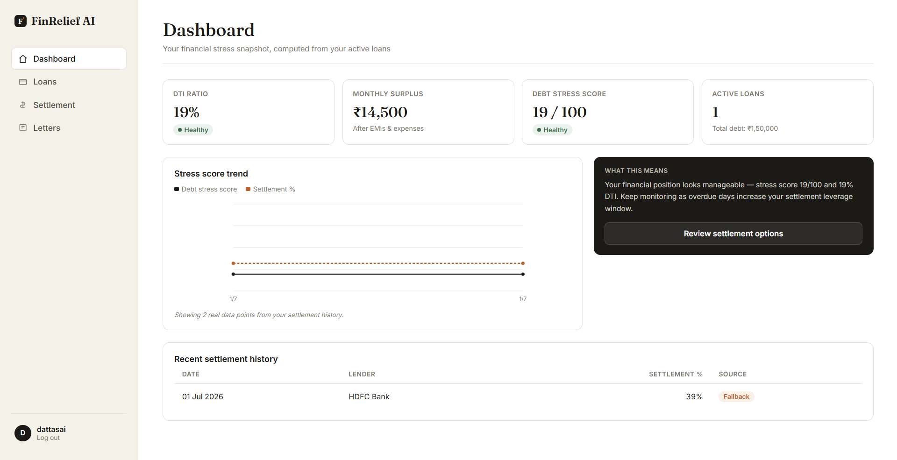
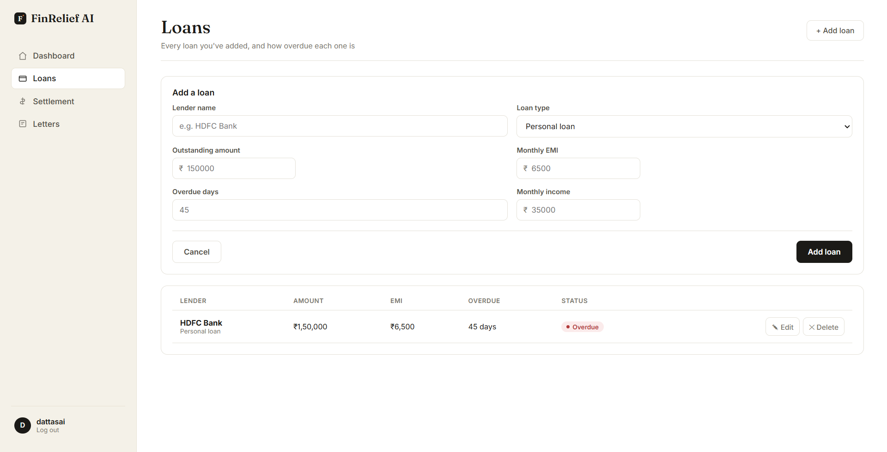
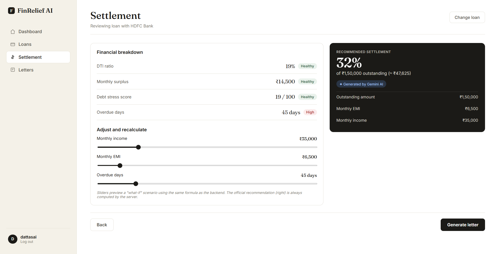
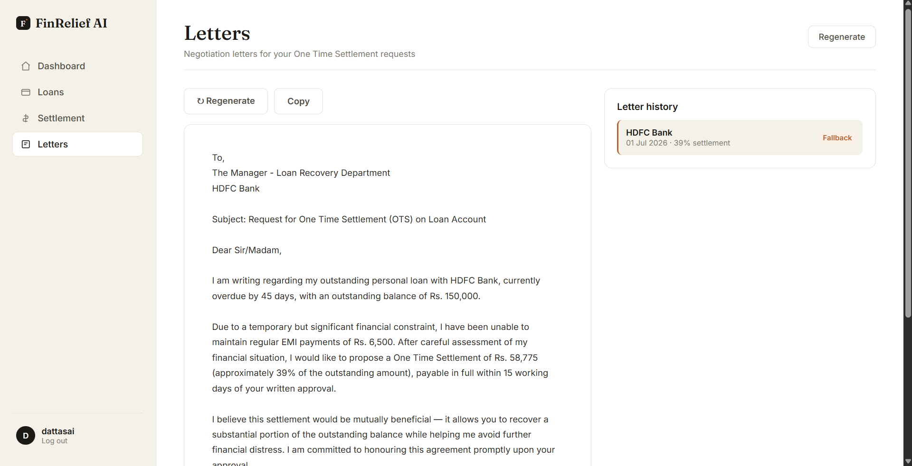

# About FinRelief AI 🧾

> **Empowering people in financial distress with AI-driven debt settlement analysis and professional negotiation letters.**

---

## 🎯 The Problem

When individuals fall behind on loan EMIs, the experience is often isolating and overwhelming. The fear of collection calls, coupled with a lack of financial literacy regarding debt restructuring, leaves many paralyzed.

They often wonder:
- *"Should I even call the bank?"*
- *"How much should I offer to settle this?"*
- *"How do I draft an email that doesn't sound desperate, but rather professional and resolute?"*

Without clear answers, debts compound, and stress levels skyrocket.

## 💡 The Solution

FinRelief AI is built to bridge this gap. It acts as a digital financial advisor that provides clarity, realistic numbers, and actionable tools for debt settlement.

### Core Use Cases:
1. **Financial Health Assessment**: Users can securely log their active debts, income, and EMIs. The app calculates crucial metrics like Debt-to-Income (DTI) ratio, monthly surplus, and a composite Debt Stress Score.
2. **One Time Settlement (OTS) Recommendation**: Using a formulaic approach, the app suggests a realistic settlement percentage based on how overdue the loan is and the user's financial strain.
3. **Automated Negotiation**: Taking the anxiety out of communication, the app utilizes Google's Gemini AI to draft professional, empathetic, and structurally sound negotiation letters tailored to the specific lender and loan state.

## 🌟 User Benefits

- **Clarity Over Confusion**: Translates raw financial data into an easy-to-understand Debt Stress Score.
- **Data-Driven Confidence**: Provides a realistic settlement figure to anchor negotiations.
- **Professional Communication**: Eliminates the stress of writing a settlement proposal from scratch. The AI-generated letters command respect and demonstrate serious intent.
- **Privacy and Security**: Financial data is sensitive. With secure authentication and local database storage (or secure cloud deployment), users remain in control of their information.

---

## 📸 A Story of Financial Recovery (Visual Walkthrough)

Here is a step-by-step look at how FinRelief AI guides a user from confusion to action.

### 1. Secure Access
Financial data requires privacy. Users start by securely registering or logging into their account.

### 2. The Dashboard: A High-Level View
Upon logging in, the user sees a snapshot of their financial health: DTI ratio, monthly surplus, and their Debt Stress Score. As they take action, the trend chart tracks their progress.

### 3. Cataloging Debt
The first step to recovery is acknowledging the debt. Users can add multiple loans, specifying the lender, amount, EMI, and how many days they are overdue.

### 4. Settlement Analysis
By selecting a loan, the user enters the Settlement Analyzer. Here, they can adjust sliders for income and EMI to see "what-if" scenarios. The app provides an official recommended settlement percentage.

### 5. Taking Action: The Negotiation Letter
With one click, the app uses AI to draft a formal One Time Settlement (OTS) request. The user can review it, copy it, and send it to their lender, taking a concrete step towards financial relief.

---

**Ready to see how it works under the hood?** Check out the [README.md](README.md) for technical setup, API documentation, and deployment instructions.
